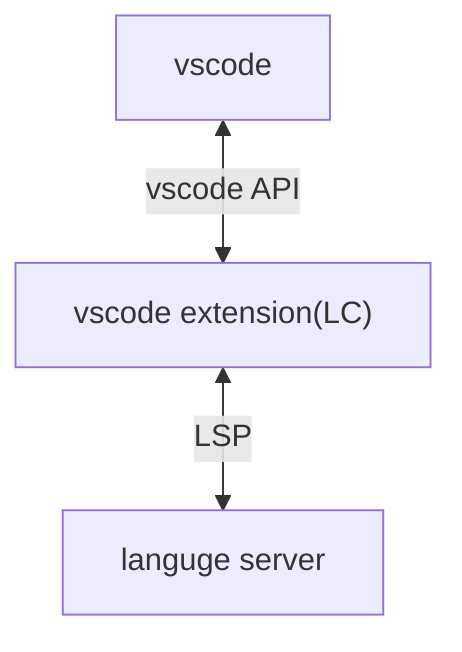

この記事では Haskell を使って簡単な Language Server(LS)を実装します。さらに、それに対応する vscode の拡張機能も実装して動作確認まで行います。

# Language Server の実装

Haskell で LS を実装するには[lsp](https://github.com/haskell/lsp)パッケージを用います。lsp パッケージは以下の 3 つに分かれています。

1. lsp
   - クライアントとのメッセージのやり取りやVirtual File System(VFS)などのLSの実態を実装している。
2. lsp-types
   - Language Server Protocol(LSP)で用いられる大量のデータ型の定義などをしている。Lensも同梱されていて大変便利。
3. lsp-test
   - LSP のテスト用のパッケージ。使ったことがないのでよくわからない。

この記事では stackage の[lts-22.43](https://www.stackage.org/lts-22.43)を用います。lts-22.43のlspは2.3.0.0、lsp-typesは2.1.1.0です。バージョンに気を付けてください。

いきなりですが、LSのサンプルコードはこちらです。GitHubの [lsp/example ディレクトリ](https://github.com/haskell/lsp/blob/lsp-2.3.0.0/lsp/example/Simple.hs)にサンプルコードがあります。

```hs
{-# LANGUAGE DuplicateRecordFields #-}
{-# LANGUAGE LambdaCase #-}
{-# LANGUAGE OverloadedStrings #-}

import Control.Monad.IO.Class
import Data.Text qualified as T
import Language.LSP.Protocol.Message
import Language.LSP.Protocol.Types
import Language.LSP.Server

handlers :: Handlers (LspM ())
handlers =
  mconcat
    [ notificationHandler SMethod_Initialized $ \_not -> do
        let params =
              ShowMessageRequestParams
                MessageType_Info
                "Turn on code lenses?"
                (Just [MessageActionItem "Turn on", MessageActionItem "Don't"])
        _ <- sendRequest SMethod_WindowShowMessageRequest params $ \case
          Right (InL (MessageActionItem "Turn on")) -> do
            let regOpts = CodeLensRegistrationOptions (InR Null) Nothing (Just False)

            _ <- registerCapability SMethod_TextDocumentCodeLens regOpts $ \_req responder -> do
              let cmd = Command "Say hello" "lsp-hello-command" Nothing
                  rsp = [CodeLens (mkRange 0 0 0 100) (Just cmd) Nothing]
              responder $ Right $ InL rsp
            pure ()
          Right _ ->
            sendNotification SMethod_WindowShowMessage (ShowMessageParams MessageType_Info "Not turning on code lenses")
          Left err ->
            sendNotification SMethod_WindowShowMessage (ShowMessageParams MessageType_Error $ "Something went wrong!\n" <> T.pack (show err))
        pure ()
    , requestHandler SMethod_TextDocumentHover $ \req responder -> do
        let TRequestMessage _ _ _ (HoverParams _doc pos _workDone) = req
            Position _l _c' = pos
            rsp = Hover (InL ms) (Just range)
            ms = mkMarkdown "Hello world"
            range = Range pos pos
        responder (Right $ InL rsp)
    ]

main :: IO Int
main =
  runServer $
    ServerDefinition
      { parseConfig = const $ const $ Right ()
      , onConfigChange = const $ pure ()
      , defaultConfig = ()
      , configSection = "demo"
      , doInitialize = \env _req -> pure $ Right env
      , staticHandlers = \_caps -> handlers
      , interpretHandler = \env -> Iso (runLspT env) liftIO
      , options = defaultOptions
      }
```

このLSには2つの機能があります。

まず1つめがLSが起動されたときに LCに`Turn on code lenses?`というタイトルのメッセージを送り、`Turn on`が選択されればCodeLensを有効にし、それ以外なら無効にするものです。これはLSがリクエストを行い、LCがLSにレスポンスを返します。

2つ目がLCからTextHoverリクエストが来た時に`Hello world`という固定値のmarkdownレスポンスを返すものです。これはLC起点のリクエストで、LSはLCにレスポンスを返します。LSPで一般的に想像されるCompletionやDiagnosticsなどはこの形式なので、馴染みやすいかもしれません。

## LS のテスト

作った LSを実際に動かしてみます。以下の内容を適当なファイルに保存してください。この時改行コードが**CRLF**になるように注意してください。vscodeなら右下のボタンから変更できます。

```json:test.json-rpc
Content-Length: 162

{
	"jsonrpc": "2.0",
	"id": 1,
	"method": "initialize",
	"params": {
        "processId": 123,
        "rootUri": null,
        "capabilities": {}
	}
}
Content-Length: 54

{
	"jsonrpc": "2.0",
	"id": 2,
	"method": "exit"
}
```

このファイルを`stack run < test.json-rpc`などとしてLSに与えると

```
[Info] Starting server
[Info] LSP: Got exit, exiting
```

という出力が得られ、LSが正常に起動と終了をしたことがわかります。原理的にはこのように LSPを手書きすることも可能です。

# Language Client の実装

Language Client(LC)とは、LSとLSPで通信を行い、各エディタ向けの言語支援を提供するもののことです。vscodeでいうとextensionになります。図にすると以下のようになります。



ということで、vscodeの拡張機能を実装していきます。vscodeでLSPを用いたextensionを実装するためのドキュメントはおもに[ここ](https://code.visualstudio.com/api/language-extensions/language-server-extension-guide)を見ればよいでしょう。
