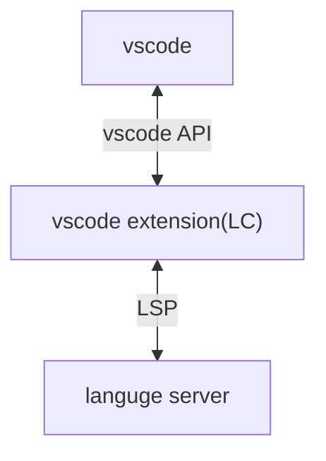

この記事ではHaskellを使って簡単なLanguage Server(LS)を実装します。さらに、それに対応するvscodeの拡張機能の実装とデバッグ環境の整備を行います。LSの実装はHaskell特有のものですが、vscodeの拡張機能の話はほかの言語にも応用できるはずです。

この記事で使ったコードは以下のリポジトリにあります。

https://github.com/Hagihara-A/oreore-ls

# Language Serverの実装

HaskellでLSを実装するには[lsp](https://github.com/haskell/lsp)パッケージを用います。lspパッケージは以下の3つに分かれています。

1. lsp
   - クライアントとのメッセージのやり取りやVirtual File System(VFS)などのLSの実態を実装している。
2. lsp-types
   - Language Server Protocol(LSP)で用いられる大量のデータ型の定義などをしている。Lensも同梱されていて大変便利。
3. lsp-test
   - LSPのテスト用のパッケージらしい。使ったことがないのでよくわからない。

この記事ではstackageの[lts-22.43](https://www.stackage.org/lts-22.43)を用います。lts-22.43のlspは2.3.0.0、lsp-typesは2.1.1.0です。バージョンに気を付けてください。

いきなりですが、LSのサンプルコードはこちらです。GitHubの[lsp/exampleディレクトリ](https://github.com/haskell/lsp/blob/lsp-2.3.0.0/lsp/example/Simple.hs)にサンプルコードがあります。

```hs
{-# LANGUAGE DuplicateRecordFields #-}
{-# LANGUAGE LambdaCase #-}
{-# LANGUAGE OverloadedStrings #-}

import Control.Monad.IO.Class
import Data.Text qualified as T
import Language.LSP.Protocol.Message
import Language.LSP.Protocol.Types
import Language.LSP.Server

handlers :: Handlers (LspM ())
handlers =
  mconcat
    [ notificationHandler SMethod_Initialized $ \_not -> do
        let params =
              ShowMessageRequestParams
                MessageType_Info
                "Turn on code lenses?"
                (Just [MessageActionItem "Turn on", MessageActionItem "Don't"])
        _ <- sendRequest SMethod_WindowShowMessageRequest params $ \case
          Right (InL (MessageActionItem "Turn on")) -> do
            let regOpts = CodeLensRegistrationOptions (InR Null) Nothing (Just False)

            _ <- registerCapability SMethod_TextDocumentCodeLens regOpts $ \_req responder -> do
              let cmd = Command "Say hello" "lsp-hello-command" Nothing
                  rsp = [CodeLens (mkRange 0 0 0 100) (Just cmd) Nothing]
              responder $ Right $ InL rsp
            pure ()
          Right _ ->
            sendNotification SMethod_WindowShowMessage (ShowMessageParams MessageType_Info "Not turning on code lenses")
          Left err ->
            sendNotification SMethod_WindowShowMessage (ShowMessageParams MessageType_Error $ "Something went wrong!\n" <> T.pack (show err))
        pure ()
    , requestHandler SMethod_TextDocumentHover $ \req responder -> do
        let TRequestMessage _ _ _ (HoverParams _doc pos _workDone) = req
            Position _l _c' = pos
            rsp = Hover (InL ms) (Just range)
            ms = mkMarkdown "Hello world"
            range = Range pos pos
        responder (Right $ InL rsp)
    ]

main :: IO Int
main =
  runServer $
    ServerDefinition
      { parseConfig = const $ const $ Right ()
      , onConfigChange = const $ pure ()
      , defaultConfig = ()
      , configSection = "demo"
      , doInitialize = \env _req -> pure $ Right env
      , staticHandlers = \_caps -> handlers
      , interpretHandler = \env -> Iso (runLspT env) liftIO
      , options = defaultOptions
      }
```

このLSには2つの機能があります。

まず1つめが、LSが起動されたときに LCに`Turn on code lenses?`というタイトルのメッセージを送り、`Turn on`が選択されればCodeLensを有効にし、それ以外なら無効にするものです。これはLSがリクエストを行い、LCがLSにレスポンスを返します。

2つ目が、LCからTextHoverリクエストが来た時に`Hello world`という固定値のmarkdownレスポンスを返すものです。これはLC起点のリクエストで、LSはLCにレスポンスを返します。LSPで一般的に想像されるCompletionやDiagnosticsなどはこの形式なので、馴染みやすいかもしれません。

## LS のテスト

作ったLSを実際に動かしてみます。以下の内容を適当なファイルに保存してください。この時改行コードが**CRLF**になるように注意してください。vscodeなら右下のボタンから変更できます。

```json:test.txt
Content-Length: 162

{
	"jsonrpc": "2.0",
	"id": 1,
	"method": "initialize",
	"params": {
        "processId": 123,
        "rootUri": null,
        "capabilities": {}
	}
}
Content-Length: 54

{
	"jsonrpc": "2.0",
	"id": 2,
	"method": "exit"
}
```

このファイルを`stack run < test.txt`などとしてLSに与えると

```
[Info] Starting server
[Info] LSP: Got exit, exiting
```

という出力が得られ、LSが正常に起動と終了をしたことがわかります。原理的にはこのようにLSPを手書きすることも可能です。

# Language Clientの実装

Language Client(LC)とは、LSとLSPで通信を行い、各エディタ向けの言語支援を提供するもののことです。vscodeでいうとextensionになります。図にすると以下のようになります。



ということで、vscodeの拡張機能を実装していきます。vscodeでLSPを用いたextensionを実装するためのドキュメントはおもに[ここ](https://code.visualstudio.com/api/language-extensions/language-server-extension-guide)を見ればよいでしょう。このドキュメントは長いのですが、飛ばし飛ばし読んでいると「ずっと悩んでたこの仕様、ここにかいてるやんけ・・・」となるので真面目に読みましょう（自戒）。

vscodeのextension(以後vsceと略)はnpmパッケージとして実装されます。まずはpackage.jsonを作ります。以下が最低限必要な内容です。各フィールドのリファレンスは[ここ](https://code.visualstudio.com/api/references/extension-manifest)にあります。

```json:package.json
{
  "name": "lsp-sample",
  "description": "A language server example",
  "version": "1.0.0",
  "engines": {
    "vscode": "^1.75.0"
  },
  "main": "./out/extension",
  "activationEvents": [
    "onLanguage:plaintext"
  ],
  "dependencies": {
    "vscode-languageclient": "^9.0.1"
  },
  "devDependencies": {
    "@types/node": "^20",
    "@types/vscode": "^1.88.0",
    "typescript": "^5.4.5"
  }
}
```

次にvsceの本体を実装します。以下が実装になります。

```ts:src/extension.ts
import { workspace, ExtensionContext } from "vscode";

import {
  LanguageClient,
  LanguageClientOptions,
  ServerOptions,
  TransportKind,
} from "vscode-languageclient/node";

let client: LanguageClient;

export function activate(context: ExtensionContext) {
  const opt = {
    command: "stack",
    args: ["run", "--"],
    transport: TransportKind.stdio,
    options: {
      cwd: "/home/arark/oreore-ls/server",
    },
  };
  const serverOptions: ServerOptions = {
    run: opt,
    debug: opt,
  };

  const clientOptions: LanguageClientOptions = {
    documentSelector: [{ scheme: "file", language: "plaintext" }],
  };

  client = new LanguageClient(
    "languageServerExample",
    "Language Server Example",
    serverOptions,
    clientOptions
  );

  client.start();
}
```

まず`serverOptions`について説明します。ServerOptionsはLSの起動を制御するオプションです。上記の設定だと

1. `/home/arark/oreore-ls/server`ディレクトリで`stack run --`を実行してLSを起動
2. 起動したLSのプロセスとstdioで通信

となります。この実装ではcwdを決め打ちで指定して`stack run`で起動しましたが、実際にはLSの実行ファイルを探したりダウンロードしてくる処理が必要なはずです。

ちなみに`vscode-languageclient`はTransportKindに応じてargsを拡張するので、`stack run --`の最後のハイフンが必要になっています。例えばpipeで起動すれば`--pipe=/run/user/1000/`がargsの末尾に追加されます。

`clientOptions`はこのextensionが監視するファイルを指定しています。この指定ではplaintextのときのみLCがLSにリクエストを送ります。

## Extensionの起動

次に実装したextensionを起動してみます。ローカルで開発したextensionの起動にはvscodeのデバッガを用います。手元でvsceをパッケージングしてvscodeにインストールすることで起動するのも可能なはずですが、こちらのほうが簡単です。

デバッガを使うので`launch.json`が必要になります。以下のファイルを用意してください。

```json:.vscode/launch.json
{
    "version": "0.2.0",
    "configurations": [
        {
            "type": "extensionHost",
            "request": "launch",
            "name": "Launch Client",
            "runtimeExecutable": "${execPath}",
            "args": [
                "--extensionDevelopmentPath=${workspaceRoot}"
            ],
            "outFiles": [
                "${workspaceRoot}/client/out/**/*.js"
            ],
            "autoAttachChildProcesses": true
        }
    ]
}
```

デバッガとlaunch.jsonの仕様について筆者が詳しくないのですが、とりあえずこれがあれば動きます。Debug用のextensionごとにそれぞれユニークな`type`を持っているため、`"type": "extensionHost"`でこのlaunch.jsonを解釈するextensionを指定しているみたいです。extensionHostとはvsceを管理するマスタープロセス(?)みたいなものです。多分。ドキュメントは[こちら](https://code.visualstudio.com/api/advanced-topics/extension-host)。

なお、開発したextensionがworkspaceのトップレベルになくてもサブディレクトリまでpackage.jsonを探しにいってくれるみたいです。

このファイルを作った状態でvscodeのデバッグタブを開いて「デバッグの実行」をクリックするか、F5を押すと、別ウィンドウでextensionが起動します。TypeScriptにSourceMapを出力させるとTSのファイル上でブレークポイントを指定できるので便利です。

正しく起動できていれば、別ウィンドウが開くと"Turn on code lenses?"という通知が表示され、テキストにホバーすると`Hello world`と表示されるはずです。

この方法で開発したextensionのデバッグをすることができます。デバッガの使い方は通常と同じです。

## LSPのメッセージの表示
ここまででデバッガを用いてextensionを起動することができました。しかしvsceの開発では、LSとLCでやり取りしているメッセージを目視で確認したいということがあります。`vscode-languageclient`はこの機能を組み込みで提供しています。

package.jsonに以下の設定を追加してください。

```diff json:package.json
{
  "name": "lsp-sample",
  "version": "1.0.0",
+  "contributes": {
+    "configuration": {
+      "type": "object",
+      "title": "Example configuration",
+      "properties": {
+        "languageServerExample.trace.server": {
+          "scope": "window",
+          "type": "string",
+          "enum": [
+            "off",
+            "messages",
+            "verbose"
+          ],
+          "default": "verbose",
+          "description": "Traces the communication between VS Code and the language server."
+        }
+      }
+    }
+  },
}
```

`[langID].trace.server`を`verbose`にすると、`vscode-languageclient`がこの設定を勝手に読み込んでLSPでやり取りしたメッセージをログに吐くようになります。extensionのログは、出力タブのLanguage Server Exampleから見ることができます。


# まとめ
以上でHaskellでLSを実装し、それに対応するvsceの実装とデバッグを行うことができました。みなさんもオレオレLSを実装してみましょう！